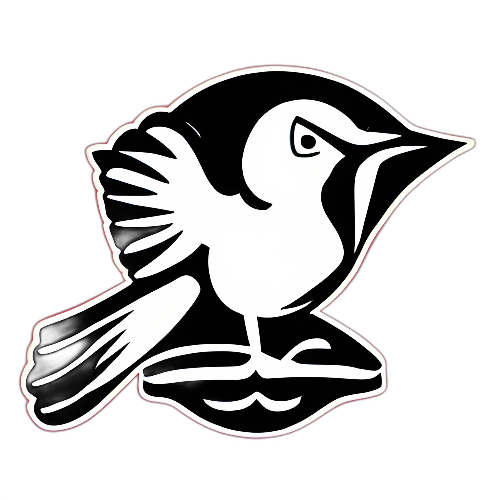

<h1 align="center">
  
</h1>

## Introduction

In the challenging landscape of battling smoking addiction, Project APUS emerges as a beacon of hope and liberation. Inspired by the determination of the Apus apus during its lengthy migrations, our aim is to assist those seeking to tread the path of breaking free from the grip of tobacco.

Much like the flight of the common swift traverses vast territories, our project seeks to break down the barriers imposed by smoking, offering an innovative and comprehensive approach to help smokers reduce and ultimately abandon this harmful habit.

Our journey is guided by a commitment to health, respect for individual freedom, and a belief in the transformative capacity of each person. The logo of Project APUS, inspired by the graceful flight of the Apus apus, symbolizes our pursuit of freedom from smoking, where each step forward is a move towards a healthier and fuller life.

## Objective

The primary objective of Project APUS is to orchestrate a transformative journey towards emancipation from the shackles of smoking addiction. We aim to forge a path illuminated by innovation and compassion, where every participant is empowered to rewrite their narrative of dependence into one of resilience and vitality.

By leveraging a multidimensional approach that melds scientific rigor with empathetic support, we aspire to redefine the narrative of cessation, turning each milestone into a testament of strength and liberation. Our mission is not just to break habits, but to ignite a revolution of self-discovery and empowerment, where the pursuit of health and freedom intertwine seamlessly.

## Documentation and demonstration

## Contributing

### Contributing Guide

### Development

## Community

### - Status & bugs

Currently Apus is under heavy development, if you wish to report bugs or ask for new features, you can directly use the [Github issues module](https://github.com/cunhaac/apus/issues).

### - Discussion

If you need support or you wish to engage a discussion about the Apus project, feel free to join us on our [Discord channel](https://discord.gg/FmnG58wDQf).

## About

### - Authors
- [Pedro Cunha](https://github.com/cunhaac) 
- [Nuno Gomes](https://github.com/ndgomes)
